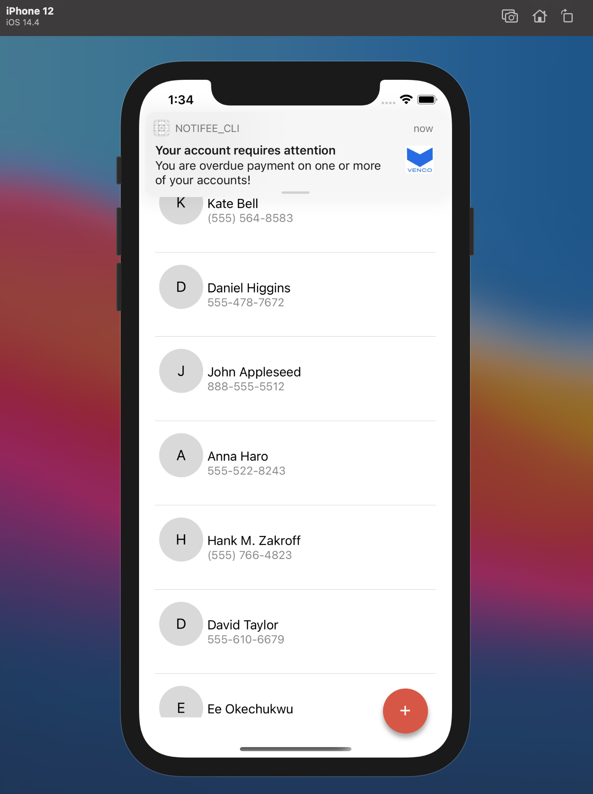

# React Native Push Notification

## Integration with Notifee

### Push notifications using Firebase & Notifee for both Android & iOS

## `Project Specifications`

- Retrieve users contacts.
- Quick Call Me from any contact amongst the user’s contacts using React Native Quick Action
- Full Screen Notifications & Custom Ringtone for Android using Notifee for presenting, with accept or reject.
- Critical Notifications & Custom Ringtone for iOS also using Notifee for presenting, with accept or reject using Notifee Press Action
- SMS & MMS (Image in notification) from contacts using push notifcations locally & remotely after being triggered with a click event on the app.
    

## `Solution Manual`

The application was build with React-Native CLI and was integrated with firebase push notification and messaging for both android and ios.

Integration was also done with Notifee to handle action labels and action press events as well as custome sounds and lot more

  

## `Usefull Links`

- [Notifee Doc] (https://notifee.app/react-native/docs/overview)
- [RN Firebase Doc] (https://rnfirebase.io/)
- [Youtube Guild] (https://www.youtube.com/watch?v=FfJ1j-uCnd4)

  

## `Screen Demo`

